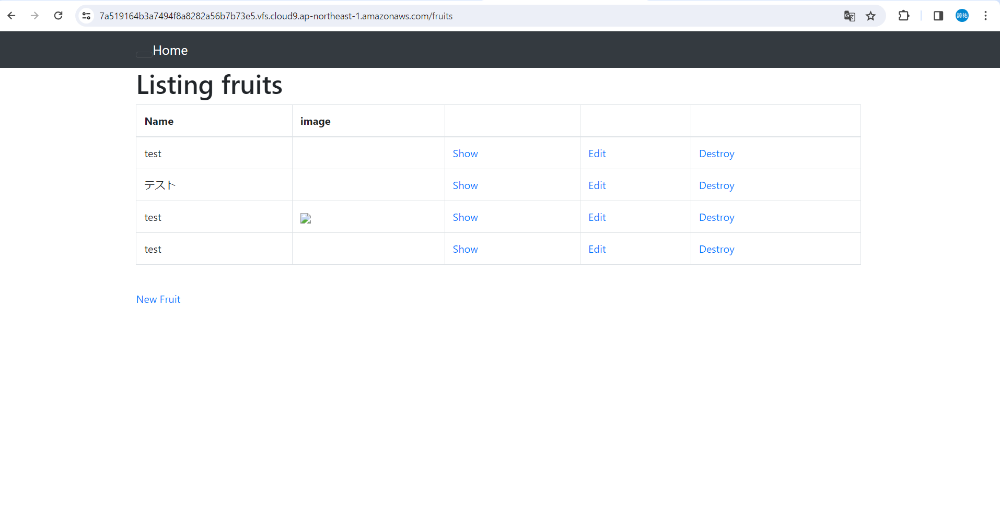
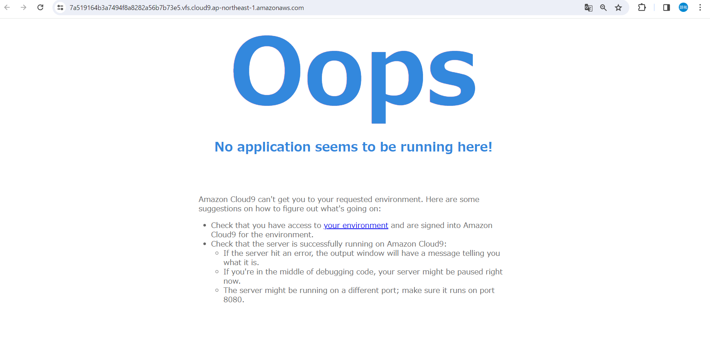
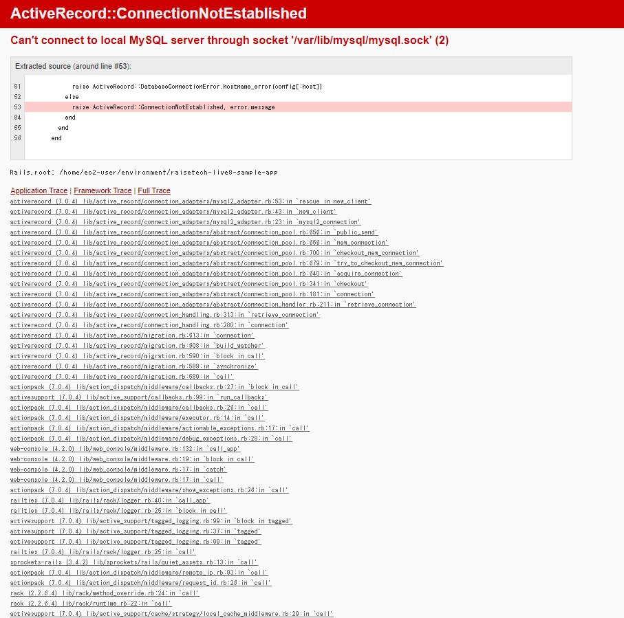

# 第３回課題提出  
## 課題内容  
1. サンプルアプリケーションの起動（デプロイ）  
2. APサーバーについて調べる  
3. BDサーバーについて調べる  
### APサーバーについて  
1. APサーバーの名前とバージョン  
Puma version: 5.6.5
2. 動作確認  
  
3. 動作停止確認  
  
### DBサーバーについて  
1. DBサーバーの名前とバージョン  
MySQL Server: Ver 8.0.35  
2. MySQLを停止  
  
3. Railsの構成管理ツール  
bundle  
### 学んだこと  
- cat：concatenate（連結）の略。ファイルの内容を表示する。  
- sudo：superuser doの略。権限が必要なコマンドを通常のユーザーが実行できるように使用する（root権限）。  
- mysql -u root -p：MySQLデータベースにrootユーザーとして接続するためのコマンド。  
- bundle install：gemをインストールするためのコマンド  
- nvm：Node.jsのバージョンを管理するためのツール。Node.jsとはWebページ作成などの際に使われるJavaScriptを、サーバー側で動作させるプラットフォーム。  
- yarn -v：yarnのバージョンを確認するためのコマンド。yarnとはJavaScriptで開発されたプログラム部品（モジュール）を管理するためのパッケージ管理システム。  
- npm（Node Package Manager）：yarnと同様に、JavaScriptプログラミング言語向けのパッケージ管理ツール。yarnの方が実行速度が高速で、コマンド体系が簡潔で分かりやすい。  
- chmod（Change Mode）：Unix系オペレーティングシステムでファイルやディレクトリのパーミッション（権限）を変更するためのコマンド。
### 学習の感想  
- アプリケーションの起動を講義に合わせて、見よう見まねでやったが、作業の意味が理解できずに調べるが、調べるごとに分からないことが出てきてしまい、多くの時間を要してしまった。  
- エラーが発生した時に、発生原因や解決方法が分からず、苦労した。学習を進めているが、自分の中で理解できているのかが正直分からないため、不安が多く残る。